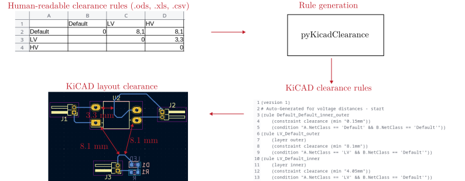
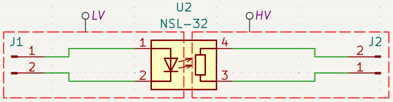
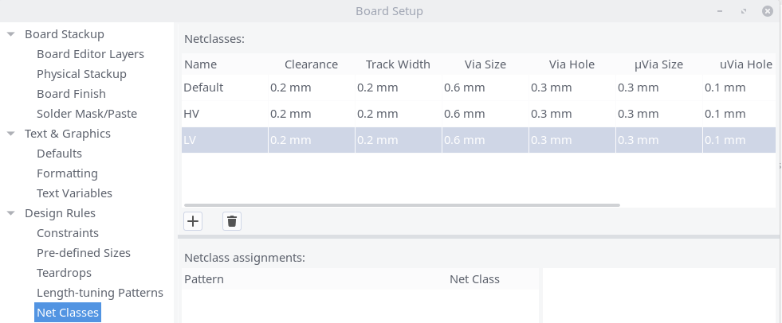

.. sectnum::

Welcome to KiClearance
==================================================

This Python program converts a given table of voltage distances into KiCad design rules.

Installation
---------------------------------------
Install KiClearance directly from pyPI:

::

    pip install kiclearance

Usage
---------------------------------------

Create a table (clearance.ods/xls/csv) in your KiCad project directory with voltage clearances defined by your requirements (e.g. standards).
Use this template as a guide: `clearance.ods <https://github.com/upb-lea/KiClearance/blob/main/examples/clearance.ods>`__.

Add the net classes to each connection in the circuit diagram.

Add the same net classes in the net classes of the PCB editor:
`KiCad PCB Editor`: `File` -> `Board Setup` -> `Design Rules` -> `Net classes`

Documentation
---------------------------------------

Find the documentation `here <https://upb-lea.github.io/KiClearance/intro.html>`__.
