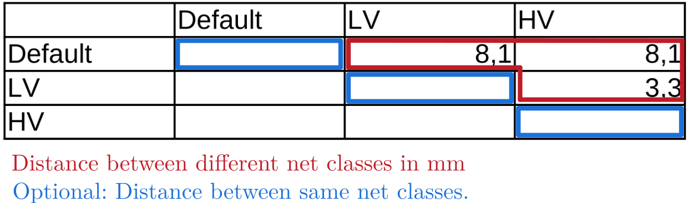

.. sectnum::

Welcome to KiClearance
==================================================

This Python program converts a given table of voltage distances into KiCad design rules.

.. image:: docs/source/figures/overview.png

Installation
---------------------------------------
Install KiClearance directly from pyPI:

::

    pip install kiclearance

Usage
---------------------------------------

Create a table 'clearance.ods/xls/csv' containing clearance distances
~~~~~~~~~~~~~~~~~~~~~~~~~~~~~~~~~~~~~~~~~~~~~~~~~~~~~~~~~~~~~~~~~~~~~

Create a table (name it clearance.ods/xls/csv) in your KiCad project directory with voltage clearances defined by your requirements (e.g. standards).
Download and use this template as a guide: `clearance.ods <https://github.com/upb-lea/KiClearance/blob/main/examples/clearance.ods>`__.

The table contains the distances from a potential to another in ``mm``. The same net distance is optional.
The default distance is ``0.15 mm``.

Define net classes in your KiCad project
~~~~~~~~~~~~~~~~~~~~~~~~~~~~~~~~~~~~~~~~
Add the net classes to each connection in the circuit diagram.

.. image:: docs/source/figures/net_class_directive_labels.png

Add the same net classes in the net classes of the PCB editor:
``KiCad PCB Editor``: ``File`` -> ``Board Setup`` -> ``Design Rules`` -> ``Net classes``

.. image:: docs/source/figures/board_setup.png

Run KiClearance
~~~~~~~~~~~~~~~

Navigate to the project folder with the KiCad project and the clearance.ods/.xls/.csv file. Open a terminal and execute :

::

    python -m kiclearance

Now a file ``yourprojectname.kicad_dru`` is generated, which contains the rule sets.

Open your KiCad project, the rule sets are now stored and you can start the routing.

As the inner layers are exposed to less dirt and no air, the distance in the inner layers is halved by default.
If this factor is to be set differently, this can be set with the following command (in the example: distance to 75%):

::

    python -m kiclearance -i 0.75

To see help and options, run

::

    python -m kiclearance --help

::

    The following arguments are possible:
    -h, --help: Prints this information,
    -f, --project_folder (Optional): Path to the folder in which the project is located. Default: Folder in which this python script is located.
    -n, --project_name (Optional): Name of the kicad project (file prefix). Default: Script will look for a file with .kicad_pro in the set folder.
    -t, --table_file (Optional): Name (and ending) of the file containing the distance values. Default name: 'clearance'.
    -i, --factor_inner_layers (Optional): Reduced factor for the inner layers. Default: 0.5
    -d, --min_track_distance (Optional): minimum track distance between two tracks on the same potential. Default: 0.15 mm.

Tips and tricks
---------------------------------------
If two network classes are assigned to a connection by mistake, this is displayed as an error in the Electrical Rules Checker (``Inspect`` -> ``Electrical Rules Checker``).

KiCad works through the rules from bottom to top:  Once an applicable rule has been found, KiCad will not search for further rules. Keep this in mind when adding more own rules except from this script here.

Example
---------------------------------------
A complete example can be found `here <https://github.com/upb-lea/KiClearance/tree/main/examples>`__.

Documentation
---------------------------------------

Find the documentation `here <https://upb-lea.github.io/KiClearance/index.html>`__.

Troubleshooting
---------------------------------------
This program has so far been tested only on Linux and Windows.

