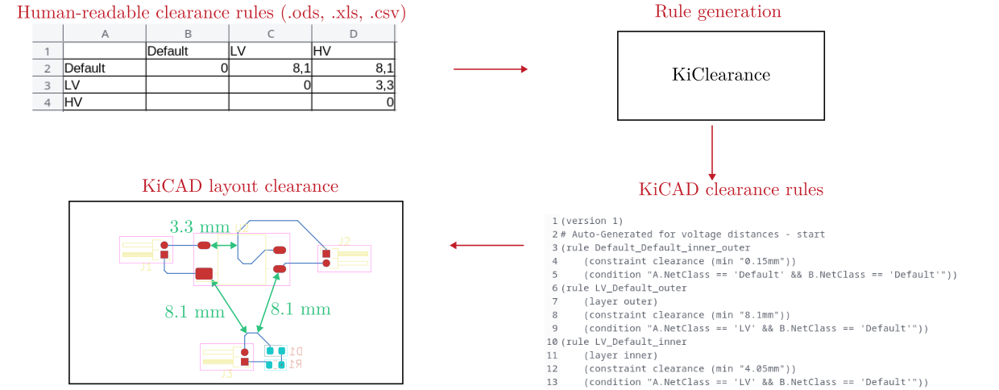

.. sectnum::

Welcome to PyKicadClearance
==================================================

Installation
---------------------------------------
Install PyKicadClearance directly from pyPI:

::

    pip install pykicadclearance

Usage
---------------------------------------

Documentation
---------------------------------------

Find the documentation `here <https://upb-lea.github.io/pykicadclearance/intro.html>`__.
